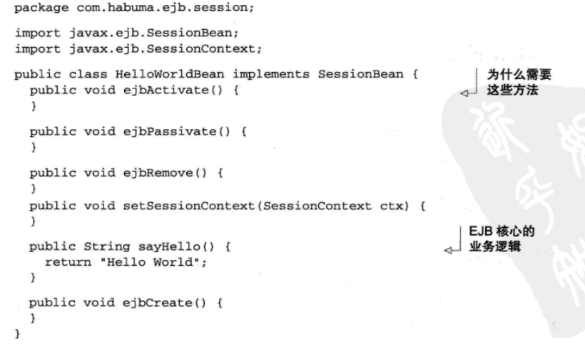
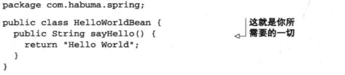
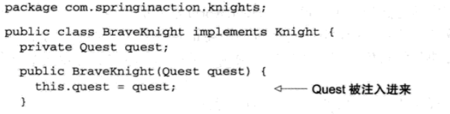
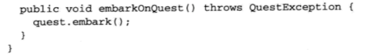
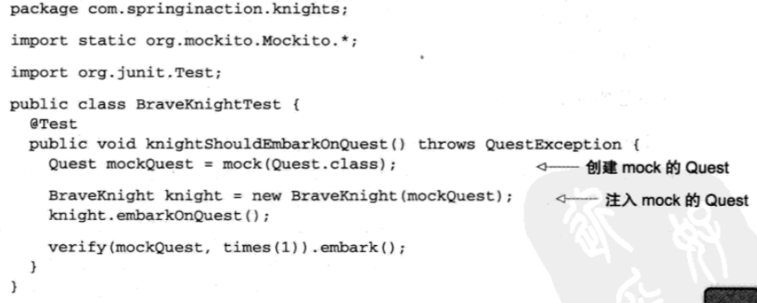
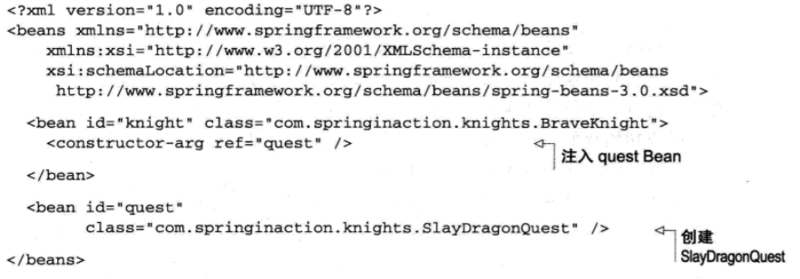
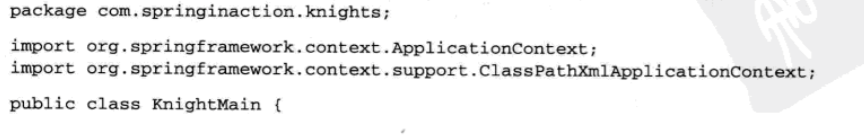
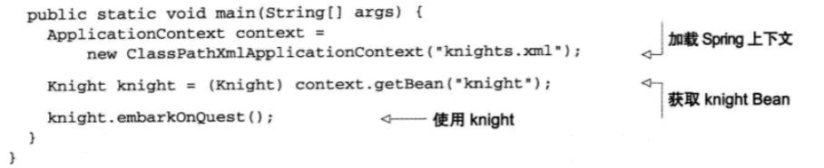

### DI
Spring诞生的最根本使命是——简化Java开发。

  为了降低Java开发的复杂性，Spring采取了以下4种关键策略：

  * 基于POJO的轻量级和最小入侵式编程

  * 通过依赖注入和面向接口编程实现松耦合

  * 基于切面和惯例进行声明式编程

  * 通过切面和模板减少样板式代码

  很多框架都会强迫应用继承它们的类或实现它们的接口从而让应用跟框架绑死。一个经典的例子是EJB2的无状态会话Bean。如下实现一个HelloWorldBean类。

  

  显然可以看到，我们仅仅是要实现输出HelloWorld的代码，但是却被迫实现SessionBean接口参与到EJB的生命周期中去，大部分代码都是为EJB写的。

  我们所需要的代码是这样的：

  

  这是一个普通的Java对象，Spring通过依赖注入来装配它。

#### 依赖注入
  
  任何一个有实际意义的应用都是由两个或者更多的类组成，这些类之间进行协作来完成特定的业务逻辑。通常，每个对象负责管理与自己相互协作的对象（即它所依赖的对象）的引用，这将会导致高度耦合和难以测试的代码。因为它的依赖是写在实现类中的，所以，这种高度耦合降低了代码的可扩展性。同时，紧密耦合的代码还难以测试，容易出现“打地鼠”式的BUG。

  另外一种方式，通过依赖注入（DI）：
###### 对象的依赖关系将由负责协调系统中各个对象的第三方组件在创建对象时设定。对象无须自行创建或管理它们的依赖关系——依赖关系被自动注入到它们的对象中。

  * 构造器注入

  

  

  使用构造器传入的类型是Request，也就是所有任务都必须实现的接口。这里，BraveKnight和任何特定Request实现发生紧密耦合了。

  同时，我们可以使用mock实现对BraveKnight的测试。

  

###### Mock：In object-oriented programming, mock objects are simulated objects that mimic the behavior of real objects in controlled ways. A computer programmer typically creates a mock object to test the behavior of some other object, in much the same way that a car designer uses a crash test dummy to simulate the dynamic behavior. of a human in vehicle impacts. Mock通常是指，在测试一个对象A时，我们构造一些假的对象来模拟与A之间的交互，而这些Mock对象的行为是我们事先设定且符合预期。通过这些Mock对象来测试A在正常逻辑，异常逻辑或压力情况下工作是否正常。

  这里mock实现了对接口的模拟对象，同时可以通过mock测试框架的一些方法来检测mock对象的调用情况。

#### 新的问题： 我们该如何把特定Quest接口的实现传递给BraveKnight呢？

  创建应用组件之间协作的行为通常称为装配。Spring有多种装配Bean方式，最为常用的方式是使用XML配置。

  下面是一个demo，让BraveKnight接受一个SlayDragonQuest的任务:

  

  看上去很方便，knight找到request了！

  这样，我们知道了装配方式，只要把装配信息读入系统中，然后启动BraveKnight就可以了。

  Spring中，应用上下文（Application Context）全权负责对象的创建和组装。Spring有几种应用上下文，分别对应了不同的配置加载方式。

  这里我们在XML文件中声明，所以选择ClassPathXmlApplicationContext作为应用上下文。该类加载位于应用系统classpath下的一个或多个XML文件。demo如下：

  

  

