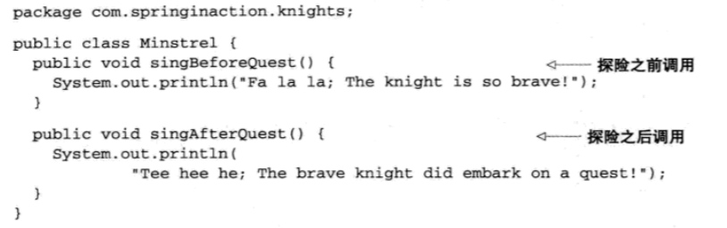

### AOP

AOP编程：将遍布应用各处的功能分离出来形成可重用的组件，是一种分离关注点的技术。

系统中许多不同组件，各自承担者不同的功能。除了各自的核心功能外，这些组件还承担着一些额外的职责。日志、事务管理、安全等此类系统服务经常融入到自身核心业务组件当中，这些系统服务被称为————横切关注点——————，因为它们总是跨越系统的多个组件。

如果这些关注点分散在多个组件中，那么：

1. 重复代码

2. 核心业务逻辑混乱

AOP所做的事情就是将这些横切关注点模块化，并以声明的方式将它们应用到它们需要影响的组件当中。

#### Spring应用AOP的demo

吟游诗人的任务是记载骑士的事迹。这样，在每个骑士的执行任务前后，都需要调用吟游诗人类的方法。

我们可以使用这样的方式来实现吟游诗人的功能：

但是，管理吟游诗人真的应该是骑士的职责吗？我们需要骑士在执行任务前后主动呼叫吟游诗人？这是吟游诗人分内的事，不需要骑士的提醒才对。另外，Minstrel被注入到了BraveKnight中，但是并不是骑士都需要吟游诗人。

在Spring中，我们可以配置文件中将Minstrel声明为一个AOP

这样，BraveKnight不显示调用Minstrel，甚至完全不知道Minstrel的存在。